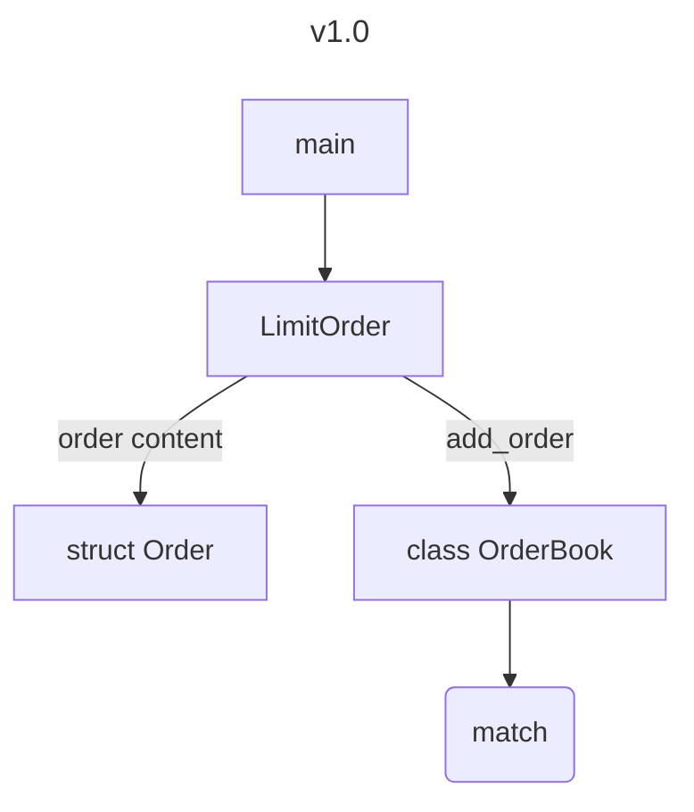

# MatchingEngine
A C++ practice side project for stock matching engine using multi-threading &amp; networking

```mermaid
---
title: v1.0
---
flowchart TD
  main--> A[LimitOrder]
  A -->|order content| struct_Order[struct Order]
  A -->|add_order| B[class OrderBook]
  B --> C(match)
```
